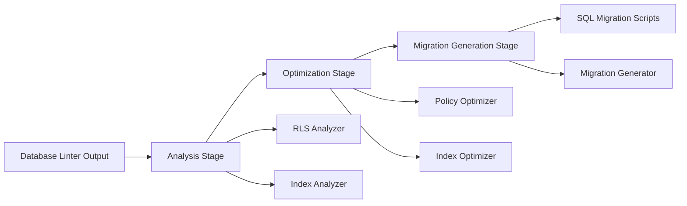

# Design Document: Database Performance Optimization

## Overview

This system analyzes and optimizes database performance issues identified by Supabase's database linter. It addresses three main categories of performance problems:

1. **RLS Policy Optimization**: Rewrites Row Level Security policies to evaluate authentication functions once per query instead of once per row
2. **Policy Consolidation**: Merges multiple permissive RLS policies into single, more efficient policies
3. **Index Management**: Removes duplicate and unused indexes, and creates missing indexes for foreign keys

The system generates safe, transactional SQL migration scripts that can be reviewed and applied to production databases.

## Architecture

The system follows a pipeline architecture with three main stages:



### Stage 1: Analysis
- Parses linter output (JSON format)
- Identifies optimization opportunities
- Categorizes issues by type and severity
- Extracts metadata (table names, policy names, index names)

### Stage 2: Optimization
- Generates optimized SQL for each issue
- Validates that optimizations preserve semantics
- Estimates performance impact
- Ranks optimizations by priority

### Stage 3: Migration Generation
- Creates transactional migration scripts
- Includes rollback scripts
- Adds validation queries
- Generates impact documentation

## Components and Interfaces

### LinterOutputParser

Parses JSON output from Supabase database linter.

```typescript
interface LinterWarning {
  name: string;
  title: string;
  level: 'WARN' | 'INFO';
  categories: string[];
  detail: string;
  metadata: Record<string, any>;
  cache_key: string;
}

interface ParsedOutput {
  rlsAuthWarnings: RLSAuthWarning[];
  multiplePermissivePolicies: MultiplePermissiveWarning[];
  duplicateIndexes: DuplicateIndexWarning[];
  unindexedForeignKeys: UnindexedFKWarning[];
  unusedIndexes: UnusedIndexWarning[];
}

function parseLinterOutput(warnings: LinterWarning[]): ParsedOutput
```

### RLSAnalyzer

Analyzes RLS policies for authentication function optimization opportunities.

```typescript
interface RLSAuthWarning {
  tableName: string;
  schemaName: string;
  policyName: string;
  authFunctions: string[]; // e.g., ['auth.uid()', 'auth.role()']
}

interface RLSOptimization {
  warning: RLSAuthWarning;
  originalSQL: string;
  optimizedSQL: string;
  estimatedImpact: string;
}

function analyzeRLSPolicies(warnings: RLSAuthWarning[]): RLSOptimization[]
```

The analyzer must:
- Extract the current policy definition from the database
- Identify all authentication function calls
- Determine if they can be safely wrapped in subqueries
- Handle complex expressions (AND, OR, nested conditions)

### PolicyConsolidator

Consolidates multiple permissive policies into single policies.

```typescript
interface MultiplePermissiveWarning {
  tableName: string;
  schemaName: string;
  role: string;
  action: 'SELECT' | 'INSERT' | 'UPDATE' | 'DELETE';
  policyNames: string[];
}

interface PolicyConsolidation {
  warning: MultiplePermissiveWarning;
  originalPolicies: PolicyDefinition[];
  consolidatedPolicy: PolicyDefinition;
  estimatedImpact: string;
}

interface PolicyDefinition {
  name: string;
  using: string; // SQL expression
  withCheck?: string; // SQL expression for INSERT/UPDATE
}

function consolidatePolicies(warnings: MultiplePermissiveWarning[]): PolicyConsolidation[]
```

The consolidator must:
- Fetch all policy definitions for the table/role/action combination
- Combine USING clauses with OR logic
- Combine WITH CHECK clauses with OR logic (if present)
- Detect conflicts (e.g., different WITH CHECK for same USING)

### IndexAnalyzer

Analyzes indexes for duplicates, unused indexes, and missing foreign key indexes.

```typescript
interface DuplicateIndexWarning {
  tableName: string;
  schemaName: string;
  indexNames: string[];
  columns: string[];
}

interface UnusedIndexWarning {
  tableName: string;
  schemaName: string;
  indexName: string;
}

interface UnindexedFKWarning {
  tableName: string;
  schemaName: string;
  fkName: string;
  fkColumns: number[]; // column positions
}

interface IndexOptimization {
  type: 'remove_duplicate' | 'remove_unused' | 'create_fk_index';
  tableName: string;
  schemaName: string;
  indexToRemove?: string;
  indexToCreate?: {
    name: string;
    columns: string[];
  };
  estimatedImpact: string;
}

function analyzeIndexes(
  duplicates: DuplicateIndexWarning[],
  unused: UnusedIndexWarning[],
  unindexedFKs: UnindexedFKWarning[]
): IndexOptimization[]
```

The analyzer must:
- For duplicates: select which index to keep (prefer explicit names)
- For unused: verify the index isn't required by constraints
- For foreign keys: determine column names from positions
- Calculate storage savings for removals
- Estimate query performance improvement for additions

### MigrationGenerator

Generates SQL migration scripts with transactions and rollback capability.

```typescript
interface MigrationScript {
  id: string;
  description: string;
  upSQL: string;
  downSQL: string;
  validationSQL: string;
  estimatedImpact: string;
}

function generateMigrations(
  rlsOptimizations: RLSOptimization[],
  policyConsolidations: PolicyConsolidation[],
  indexOptimizations: IndexOptimization[]
): MigrationScript[]
```

The generator must:
- Wrap all operations in transactions
- Use `CREATE POLICY` with same name after `DROP POLICY`
- Use `DROP INDEX CONCURRENTLY` for index removal
- Use `CREATE INDEX CONCURRENTLY` for index creation
- Include validation queries to verify correctness
- Add comments with impact estimates

## Data Models

### Database Schema Queries

The system needs to query the database for current definitions:

```sql
-- Get RLS policy definition
SELECT 
  schemaname,
  tablename,
  policyname,
  permissive,
  roles,
  cmd,
  qual, -- USING clause
  with_check -- WITH CHECK clause
FROM pg_policies
WHERE schemaname = $1 AND tablename = $2 AND policyname = $3;

-- Get index definition
SELECT
  schemaname,
  tablename,
  indexname,
  indexdef
FROM pg_indexes
WHERE schemaname = $1 AND tablename = $2 AND indexname = $3;

-- Get foreign key columns
SELECT
  a.attname as column_name,
  a.attnum as column_position
FROM pg_constraint c
JOIN pg_attribute a ON a.attrelid = c.conrelid AND a.attnum = ANY(c.conkey)
WHERE c.contype = 'f'
  AND c.conname = $1
ORDER BY array_position(c.conkey, a.attnum);

-- Check if index is used
SELECT
  schemaname,
  tablename,
  indexname,
  idx_scan,
  idx_tup_read,
  idx_tup_fetch
FROM pg_stat_user_indexes
WHERE schemaname = $1 AND tablename = $2 AND indexname = $3;
```

### SQL Generation Patterns

#### RLS Policy Optimization

Original:
```sql
CREATE POLICY "policy_name" ON schema.table
FOR SELECT TO authenticated
USING (auth.uid() = user_id);
```

Optimized:
```sql
CREATE POLICY "policy_name" ON schema.table
FOR SELECT TO authenticated
USING ((SELECT auth.uid()) = user_id);
```

#### Policy Consolidation

Original:
```sql
CREATE POLICY "policy_1" ON schema.table
FOR SELECT TO authenticated
USING (condition_1);

CREATE POLICY "policy_2" ON schema.table
FOR SELECT TO authenticated
USING (condition_2);
```

Consolidated:
```sql
CREATE POLICY "policy_consolidated" ON schema.table
FOR SELECT TO authenticated
USING (condition_1 OR condition_2);
```

#### Index Operations

Remove duplicate:
```sql
DROP INDEX CONCURRENTLY schema.duplicate_index_name;
```

Create foreign key index:
```sql
CREATE INDEX CONCURRENTLY idx_table_fk_column 
ON schema.table (fk_column);
```

## Correctness Properties


A property is a characteristic or behavior that should hold true across all valid executions of a system—essentially, a formal statement about what the system should do. Properties serve as the bridge between human-readable specifications and machine-verifiable correctness guarantees.

### Property 1: RLS Auth Function Detection

*For any* RLS policy SQL string, if it contains `auth.uid()`, `auth.jwt()`, or `auth.role()` without being wrapped in a `(SELECT ...)` subquery, then the Policy_Optimizer should identify it as requiring optimization.

**Validates: Requirements 1.1**

### Property 2: Auth Function Wrapping

*For any* RLS policy that requires optimization, after optimization all authentication function calls (`auth.uid()`, `auth.jwt()`, `auth.role()`) should be wrapped in `(SELECT ...)` subqueries.

**Validates: Requirements 1.2**

### Property 3: Current Setting Replacement

*For any* RLS policy containing `current_setting('request.jwt.claims', true)::json->>'sub'`, the optimized version should replace it with `(SELECT auth.uid())`.

**Validates: Requirements 1.5**

### Property 4: Multiple Auth Function Wrapping

*For any* RLS policy containing multiple authentication function calls, each function call should be wrapped independently in its own `(SELECT ...)` subquery.

**Validates: Requirements 7.2**

### Property 5: Semantic Preservation

*For any* optimization (RLS or policy consolidation), the optimized version should grant access to exactly the same set of rows as the original version(s) for all possible database states and user contexts.

**Validates: Requirements 1.3, 2.3, 5.2**

### Property 6: Permissive Policy Consolidation Detection

*For any* set of RLS policies on the same table, if multiple policies exist with the same role, action, and permissive type, then the Policy_Optimizer should identify them as consolidation candidates.

**Validates: Requirements 2.1**

### Property 7: OR Logic Consolidation

*For any* set of policies being consolidated, the resulting policy's USING clause should be the OR combination of all original USING clauses, and if WITH CHECK clauses exist, they should also be OR-combined.

**Validates: Requirements 2.2**

### Property 8: Conflicting Policy Detection

*For any* set of policies where USING and WITH CHECK clauses conflict (cannot be safely combined), the Policy_Optimizer should not consolidate them and should document the conflict.

**Validates: Requirements 2.5**

### Property 9: Policy Type Separation

*For any* table with both permissive and restrictive policies, the Policy_Optimizer should never consolidate policies across these types.

**Validates: Requirements 7.3**

### Property 10: Duplicate Index Detection

*For any* set of indexes on the same table and columns with identical definitions, the Index_Analyzer should identify all but one as duplicates.

**Validates: Requirements 3.1**

### Property 11: Duplicate Index Preservation

*For any* set of duplicate indexes, exactly one index should be preserved and all others should be marked for removal.

**Validates: Requirements 3.2**

### Property 12: Explicit Name Preference

*For any* set of duplicate indexes, if some have explicit names (not auto-generated patterns like `idx_*_key`) and others have auto-generated names, the Index_Analyzer should preserve an explicitly-named index.

**Validates: Requirements 3.3**

### Property 13: Constraint-Backed Index Preservation

*For any* index that is required by a foreign key constraint, unique constraint, or primary key, the Index_Analyzer should never mark it for removal, regardless of duplication or usage statistics.

**Validates: Requirements 3.5, 7.4, 9.2**

### Property 14: Unindexed Foreign Key Detection

*For any* foreign key constraint, if no index exists covering the foreign key columns in the correct order, then the Index_Analyzer should identify it as requiring an index.

**Validates: Requirements 8.1**

### Property 15: Foreign Key Index Column Order

*For any* foreign key index being created, the index columns should match the foreign key column order exactly.

**Validates: Requirements 8.2**

### Property 16: Composite Foreign Key Indexes

*For any* foreign key with multiple columns, the generated index should be a composite index covering all columns in the foreign key order.

**Validates: Requirements 8.5**

### Property 17: Unused Index Detection

*For any* index where database statistics show zero usage (idx_scan = 0), the Index_Analyzer should identify it as a candidate for removal.

**Validates: Requirements 9.1**

### Property 18: Unused Duplicate Prioritization

*For any* set of duplicate indexes where some are used and others are unused, the Index_Analyzer should prioritize unused indexes for removal.

**Validates: Requirements 9.3**

### Property 19: Recent Index Protection

*For any* unused index that was created recently (within a configurable threshold), the Index_Analyzer should flag it for review rather than marking it for automatic removal.

**Validates: Requirements 9.5**

### Property 20: Safe Migration Structure

*For any* generated migration, it should include transaction boundaries (BEGIN/COMMIT), a rollback script (down migration), and validation queries.

**Validates: Requirements 4.1, 4.2, 5.4**

### Property 21: Non-Blocking SQL Patterns

*For any* generated migration involving index operations, DROP INDEX statements should include CONCURRENTLY, and CREATE INDEX statements should include CONCURRENTLY to avoid table locking.

**Validates: Requirements 4.5, 8.3**

### Property 22: RLS Policy Recreation Pattern

*For any* RLS policy optimization migration, the migration should DROP the old policy and CREATE a new policy with the same name.

**Validates: Requirements 4.4**

### Property 23: SQL Syntax Validation

*For any* generated SQL in migrations, the SQL should be syntactically valid and parseable.

**Validates: Requirements 4.3**

### Property 24: Migration Generation Completeness

*For any* optimization (RLS, policy consolidation, or index operation), a corresponding migration script should be generated.

**Validates: Requirements 1.4, 2.4, 3.4, 9.4**

### Property 25: Impact Estimation Completeness

*For any* optimization, the output should include an estimated performance impact, and this estimate should be included in the generated migration script comments.

**Validates: Requirements 6.1, 6.2, 6.3, 6.4**

### Property 26: Impact-Based Ranking

*For any* set of multiple optimizations, they should be ranked/ordered by their estimated performance impact (highest impact first).

**Validates: Requirements 6.5**

### Property 27: Validation Query Generation

*For any* optimization, the Policy_Optimizer should generate test queries that can verify the optimization preserves correct behavior.

**Validates: Requirements 5.1**

### Property 28: Validation Failure Handling

*For any* optimization where validation fails, the Policy_Optimizer should reject the optimization, not generate a migration, and log the failure reason.

**Validates: Requirements 5.5**

### Property 29: Complex Expression Handling

*For any* RLS policy with complex expressions (nested AND/OR, multiple conditions), the Policy_Optimizer should correctly parse the expression tree and wrap only the authentication function calls.

**Validates: Requirements 7.1**

### Property 30: Safe Optimization Skipping

*For any* optimization that cannot be performed safely (e.g., due to complex expressions, conflicts, or constraints), the Policy_Optimizer should skip it and document the reason.

**Validates: Requirements 7.5**

## Error Handling

### Parsing Errors

- Invalid JSON input: Return error with details about JSON structure
- Missing required fields: Return error listing missing fields
- Unknown warning types: Log warning and skip, continue processing other warnings

### Database Connection Errors

- Connection failure: Retry with exponential backoff (3 attempts)
- Query timeout: Fail fast with clear error message
- Permission denied: Return error indicating required database permissions

### Optimization Errors

- Cannot fetch policy definition: Skip optimization, log error
- Cannot parse SQL expression: Skip optimization, log error with SQL
- Semantic validation fails: Reject optimization, log validation failure details
- Conflicting policies detected: Skip consolidation, document conflict

### Migration Generation Errors

- Invalid SQL syntax: Reject migration, log syntax error
- Missing required metadata: Skip migration, log missing data
- Rollback script generation fails: Reject migration (safety requirement)

### Safety Checks

- Never remove indexes backing constraints (FK, unique, PK)
- Never consolidate permissive and restrictive policies
- Never optimize policies with unsupported expression patterns
- Always validate SQL syntax before output
- Always include rollback capability

## Testing Strategy

### Dual Testing Approach

This feature requires both unit tests and property-based tests:

- **Unit tests**: Verify specific examples, edge cases, and error conditions
- **Property tests**: Verify universal properties across all inputs

### Unit Testing Focus

Unit tests should cover:
- Specific linter output examples from real Supabase warnings
- Edge cases: empty input, single warning, malformed JSON
- Error conditions: database connection failures, invalid SQL
- Integration: end-to-end flow from linter output to migration scripts

### Property-Based Testing Focus

Property tests should cover:
- All 30 correctness properties defined above
- Each test should run minimum 100 iterations
- Use property-based testing library (e.g., fast-check for TypeScript, Hypothesis for Python)
- Generate random: policy SQL, index definitions, warning combinations
- Tag format: **Feature: database-performance-optimization, Property {number}: {property_text}**

### Test Data Generation

For property-based tests, generate:
- Random RLS policy SQL with various auth function patterns
- Random sets of policies with different roles/actions/types
- Random index definitions with various column combinations
- Random database statistics (usage counts, sizes)
- Random foreign key definitions with 1-5 columns

### Validation Approach

For semantic preservation properties (Property 5):
- Generate test database states
- Execute original and optimized policies
- Compare result sets for equality
- Test with various user contexts (different auth.uid() values)

### Performance Testing

While not part of correctness properties:
- Benchmark RLS policy execution before/after optimization
- Measure query performance with/without foreign key indexes
- Verify storage savings from index removal
- These are manual validation steps, not automated tests
