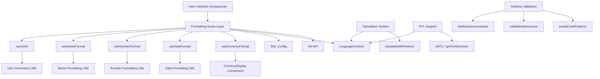

# Design Document: Internationalization Improvements

## Overview

This design addresses comprehensive internationalization improvements for the e-commerce application. While the application has strong foundations with translation support for 20 languages, international address input for 16 countries, and international phone input for 43 countries, several critical gaps prevent a truly international user experience.

This design introduces:
- Standardized currency formatting using the existing CurrencyDisplay component
- Locale-aware date and time formatting with timezone support
- Locale-aware number formatting for integers, decimals, percentages, and compact notation
- Complete translation coverage with parameter interpolation
- Name formatting that respects cultural conventions (Western vs Eastern name order)
- RTL (Right-to-Left) layout support for Arabic and Hebrew
- Enhanced address validation with country-specific postal code patterns
- Measurement unit conversion between metric and imperial systems

The design leverages JavaScript's built-in Intl API for robust internationalization support and extends the existing LanguageContext and Site_Config infrastructure.

## Architecture

### High-Level Architecture




### Design Principles

1. **Leverage Existing Infrastructure**: Build on the existing LanguageContext, CurrencyDisplay component, and Site_Config rather than creating parallel systems

2. **Use Native Intl API**: Utilize JavaScript's built-in Intl.DateTimeFormat, Intl.NumberFormat, and Intl.RelativeTimeFormat for robust, standards-compliant formatting

3. **Hook-Based Architecture**: Provide React hooks that encapsulate formatting logic and automatically respond to language/locale changes

4. **Configuration Over Code**: Store internationalization preferences in Site_Config to allow runtime configuration without code changes

5. **Progressive Enhancement**: Implement changes incrementally by priority phase (Critical → Important → Enhancement)

6. **Zero Breaking Changes**: All new utilities are additive; existing code continues to work while being gradually migrated

### Component Layers

**Layer 1: Configuration**
- Site_Config: Extended with i18n settings (currency, timezone, date format, name order, etc.)
- LanguageContext: Existing context providing current language

**Layer 2: Formatting Hooks**
- useCurrencyFormat: Currency formatting utilities
- useDateFormat: Date and time formatting utilities
- useNumberFormat: Number formatting utilities
- useNameFormat: Name formatting utilities
- useUnits: Measurement unit conversion utilities

**Layer 3: Utility Functions**
- translateWithParams: Translation with parameter interpolation
- isRTL / getTextDirection: RTL detection and direction utilities
- postalCodePatterns: Country-specific postal code validation
- validateAddressLine: Address validation logic

**Layer 4: Components**
- CurrencyDisplay: Existing component (to be used consistently)
- AddressAutocomplete: New component for address suggestions

## Components and Interfaces

### 1. Site Configuration Extension


Extend the existing Site_Config interface with internationalization settings:

```typescript
interface SiteConfig {
  // ... existing fields
  
  // Currency settings
  currency: 'USD' | 'EUR' | 'GBP' | 'JPY' | 'CNY' | 'INR' | 'CAD' | 'AUD' | 'MXN' | 'BRL';
  currencyDisplay: 'symbol' | 'code' | 'name'; // $100, USD 100, 100 US Dollars
  decimalPlaces: number; // 2 for most currencies, 0 for JPY
  
  // Date and time settings
  timezone: string; // IANA timezone (e.g., 'America/New_York', 'Europe/London', 'Asia/Tokyo')
  dateFormat: 'MDY' | 'DMY' | 'YMD'; // US, EU, Asia
  timeFormat: '12h' | '24h';
  
  // Name formatting settings
  nameOrder: 'western' | 'eastern'; // First Last vs Last First
  nameFormat: 'formal' | 'casual'; // Mr. Smith vs John
}
```

### 2. Currency Formatting Hook

```typescript
// src/app/hooks/useCurrencyFormat.ts
import { useCurrency } from '../components/CurrencyDisplay';

interface CurrencyFormatResult {
  currency: string;
  formatPrice: (amount: number) => string;
  formatRange: (min: number, max: number) => string;
  symbol: string;
}

export function useCurrencyFormat(): CurrencyFormatResult {
  const { currency, format, convert } = useCurrency();
  
  return {
    currency,
    formatPrice: (amount: number) => format(amount),
    formatRange: (min: number, max: number) => `${format(min)} - ${format(max)}`,
    symbol: getCurrencySymbol(currency),
  };
}

function getCurrencySymbol(currency: string): string {
  const symbols: Record<string, string> = {
    USD: '$', EUR: '€', GBP: '£', JPY: '¥',
    CNY: '¥', INR: '₹', CAD: 'CA$', AUD: 'A$',
    MXN: 'MX$', BRL: 'R$',
  };
  return symbols[currency] || currency;
}
```

### 3. Date Formatting Hook


```typescript
// src/app/hooks/useDateFormat.ts
import { useLanguage } from '../context/LanguageContext';

interface DateFormatResult {
  formatDate: (date: Date | string, options?: Intl.DateTimeFormatOptions) => string;
  formatShortDate: (date: Date | string) => string;
  formatTime: (date: Date | string) => string;
  formatRelative: (date: Date | string) => string;
}

export function useDateFormat(): DateFormatResult {
  const { language } = useLanguage();
  
  const formatDate = (date: Date | string, options?: Intl.DateTimeFormatOptions) => {
    const dateObj = typeof date === 'string' ? new Date(date) : date;
    return new Intl.DateTimeFormat(language, {
      year: 'numeric',
      month: 'long',
      day: 'numeric',
      ...options,
    }).format(dateObj);
  };
  
  const formatShortDate = (date: Date | string) => {
    const dateObj = typeof date === 'string' ? new Date(date) : date;
    return new Intl.DateTimeFormat(language, {
      year: 'numeric',
      month: 'short',
      day: 'numeric',
    }).format(dateObj);
  };
  
  const formatTime = (date: Date | string) => {
    const dateObj = typeof date === 'string' ? new Date(date) : date;
    return new Intl.DateTimeFormat(language, {
      hour: 'numeric',
      minute: 'numeric',
      hour12: language.startsWith('en'),
    }).format(dateObj);
  };
  
  const formatRelative = (date: Date | string) => {
    const dateObj = typeof date === 'string' ? new Date(date) : date;
    const rtf = new Intl.RelativeTimeFormat(language, { numeric: 'auto' });
    const diffInDays = Math.floor((dateObj.getTime() - Date.now()) / (1000 * 60 * 60 * 24));
    
    if (Math.abs(diffInDays) < 1) return 'today';
    if (Math.abs(diffInDays) < 7) return rtf.format(diffInDays, 'day');
    if (Math.abs(diffInDays) < 30) return rtf.format(Math.floor(diffInDays / 7), 'week');
    return rtf.format(Math.floor(diffInDays / 30), 'month');
  };
  
  return {
    formatDate,
    formatShortDate,
    formatTime,
    formatRelative,
  };
}
```

### 4. Timezone Utilities

```typescript
// src/app/utils/timezone.ts
export function convertToSiteTimezone(date: Date, timezone: string): Date {
  return new Date(date.toLocaleString('en-US', { timeZone: timezone }));
}

export function addDaysInTimezone(date: Date, days: number, timezone: string): Date {
  const localDate = convertToSiteTimezone(date, timezone);
  localDate.setDate(localDate.getDate() + days);
  return localDate;
}
```

### 5. Number Formatting Hook


```typescript
// src/app/hooks/useNumberFormat.ts
import { useLanguage } from '../context/LanguageContext';

interface NumberFormatResult {
  formatNumber: (value: number, options?: Intl.NumberFormatOptions) => string;
  formatInteger: (value: number) => string;
  formatDecimal: (value: number, decimals?: number) => string;
  formatPercent: (value: number) => string;
  formatCompact: (value: number) => string;
}

export function useNumberFormat(): NumberFormatResult {
  const { language } = useLanguage();
  
  const formatNumber = (value: number, options?: Intl.NumberFormatOptions) => {
    return new Intl.NumberFormat(language, options).format(value);
  };
  
  const formatInteger = (value: number) => {
    return new Intl.NumberFormat(language, {
      maximumFractionDigits: 0,
    }).format(value);
  };
  
  const formatDecimal = (value: number, decimals: number = 2) => {
    return new Intl.NumberFormat(language, {
      minimumFractionDigits: decimals,
      maximumFractionDigits: decimals,
    }).format(value);
  };
  
  const formatPercent = (value: number) => {
    return new Intl.NumberFormat(language, {
      style: 'percent',
      minimumFractionDigits: 1,
      maximumFractionDigits: 1,
    }).format(value / 100);
  };
  
  const formatCompact = (value: number) => {
    return new Intl.NumberFormat(language, {
      notation: 'compact',
      compactDisplay: 'short',
    }).format(value);
  };
  
  return {
    formatNumber,
    formatInteger,
    formatDecimal,
    formatPercent,
    formatCompact,
  };
}
```

### 6. Translation Parameter Interpolation

```typescript
// src/app/utils/translationHelpers.ts
import { TranslationKey } from '../context/LanguageContext';

export function translateWithParams(
  t: (key: TranslationKey) => string,
  key: TranslationKey,
  params: Record<string, string | number>
): string {
  let text = t(key);
  
  Object.entries(params).forEach(([paramKey, value]) => {
    text = text.replace(`{${paramKey}}`, String(value));
  });
  
  return text;
}
```

### 7. Name Formatting Hook


```typescript
// src/app/hooks/useNameFormat.ts
import { useLanguage } from '../context/LanguageContext';

interface NameFormatResult {
  formatFullName: (firstName: string, lastName: string, middleName?: string) => string;
  formatFormalName: (firstName: string, lastName: string, title?: string) => string;
}

export function useNameFormat(): NameFormatResult {
  const { language } = useLanguage();
  
  const formatFullName = (
    firstName: string,
    lastName: string,
    middleName?: string
  ): string => {
    // Asian languages: Family name first
    if (['ja', 'zh', 'ko'].includes(language)) {
      return middleName 
        ? `${lastName} ${middleName} ${firstName}`
        : `${lastName} ${firstName}`;
    }
    
    // Western languages: Given name first
    return middleName
      ? `${firstName} ${middleName} ${lastName}`
      : `${firstName} ${lastName}`;
  };
  
  const formatFormalName = (
    firstName: string,
    lastName: string,
    title?: string
  ): string => {
    const fullName = formatFullName(firstName, lastName);
    return title ? `${title} ${fullName}` : fullName;
  };
  
  return {
    formatFullName,
    formatFormalName,
  };
}
```

### 8. RTL Support Utilities

```typescript
// src/app/utils/rtl.ts
export const RTL_LANGUAGES = ['ar', 'he'];

export function isRTL(language: string): boolean {
  return RTL_LANGUAGES.includes(language);
}

export function getTextDirection(language: string): 'ltr' | 'rtl' {
  return isRTL(language) ? 'rtl' : 'ltr';
}
```

### 9. RTL Layout Integration

```typescript
// In root App component or layout
import { useLanguage } from './context/LanguageContext';
import { getTextDirection } from './utils/rtl';
import { useEffect } from 'react';

export function App() {
  const { language } = useLanguage();
  const direction = getTextDirection(language);
  
  useEffect(() => {
    document.documentElement.dir = direction;
    document.documentElement.lang = language;
  }, [language, direction]);
  
  return <div dir={direction}>{/* app content */}</div>;
}
```

### 10. Enhanced Address Validation


```typescript
// src/app/utils/addressValidation.ts (extend existing file)

export const postalCodePatterns: Record<string, RegExp> = {
  US: /^\d{5}(-\d{4})?$/,
  CA: /^[A-Z]\d[A-Z] \d[A-Z]\d$/,
  GB: /^[A-Z]{1,2}\d{1,2}[A-Z]?\s?\d[A-Z]{2}$/,
  DE: /^\d{5}$/,
  FR: /^\d{5}$/,
  JP: /^\d{3}-\d{4}$/,
  CN: /^\d{6}$/,
  IN: /^\d{6}$/,
  AU: /^\d{4}$/,
  BR: /^\d{5}-\d{3}$/,
  MX: /^\d{5}$/,
  ES: /^\d{5}$/,
  IT: /^\d{5}$/,
  NL: /^\d{4}\s?[A-Z]{2}$/,
  SE: /^\d{3}\s?\d{2}$/,
  NO: /^\d{4}$/,
};

export function validatePostalCode(postalCode: string, country: string): boolean {
  const pattern = postalCodePatterns[country];
  if (!pattern) return true; // No pattern defined, accept any
  return pattern.test(postalCode);
}

export function validateAddressLine(line: string, country: string): string | null {
  // Check for PO Box restrictions (US only for now)
  if (country === 'US' && /P\.?O\.?\s*Box/i.test(line)) {
    return 'PO Boxes not allowed for this country';
  }
  
  // Check minimum length
  if (line.trim().length < 3) {
    return 'Address too short';
  }
  
  return null; // Valid
}
```

### 11. Address Autocomplete Component

```typescript
// src/app/components/ui/address-autocomplete.tsx
import { useState, useCallback } from 'react';

interface AddressData {
  line1: string;
  line2?: string;
  city: string;
  state: string;
  postalCode: string;
  country: string;
}

interface AddressAutocompleteProps {
  onSelect: (address: AddressData) => void;
  country?: string;
  placeholder?: string;
}

export function AddressAutocomplete({ 
  onSelect, 
  country,
  placeholder = 'Start typing address...'
}: AddressAutocompleteProps) {
  const [query, setQuery] = useState('');
  const [suggestions, setSuggestions] = useState<any[]>([]);
  
  const handleSearch = useCallback(async (searchQuery: string) => {
    // Integration with Google Places API or similar service
    // This is a placeholder for the actual implementation
    const results = await fetchAddressSuggestions(searchQuery, country);
    setSuggestions(results);
  }, [country]);
  
  const handleSelect = useCallback((suggestion: any) => {
    const parsedAddress = parseAddressSuggestion(suggestion);
    onSelect(parsedAddress);
    setQuery('');
    setSuggestions([]);
  }, [onSelect]);
  
  return (
    <div className="address-autocomplete">
      <input
        type="text"
        value={query}
        onChange={(e) => {
          setQuery(e.target.value);
          if (e.target.value.length >= 3) {
            handleSearch(e.target.value);
          }
        }}
        placeholder={placeholder}
      />
      {suggestions.length > 0 && (
        <ul className="suggestions">
          {suggestions.map((suggestion, idx) => (
            <li key={idx} onClick={() => handleSelect(suggestion)}>
              {suggestion.description}
            </li>
          ))}
        </ul>
      )}
    </div>
  );
}

// Placeholder functions - actual implementation depends on chosen service
async function fetchAddressSuggestions(query: string, country?: string): Promise<any[]> {
  // Implement API call to address service
  return [];
}

function parseAddressSuggestion(suggestion: any): AddressData {
  // Parse service response into AddressData format
  return {
    line1: '',
    city: '',
    state: '',
    postalCode: '',
    country: '',
  };
}
```

### 12. Measurement Unit Conversion Hook


```typescript
// src/app/hooks/useUnits.ts
import { useSite } from '../context/SiteContext'; // Assuming this exists

type UnitSystem = 'metric' | 'imperial';

interface UnitsResult {
  formatWeight: (grams: number) => string;
  formatLength: (cm: number) => string;
  system: UnitSystem;
}

export function useUnits(): UnitsResult {
  const { country } = useSite();
  const system = getUnitSystem(country);
  
  const formatWeight = (grams: number): string => {
    if (system === 'imperial') {
      const pounds = grams / 453.592;
      return `${pounds.toFixed(2)} lbs`;
    }
    if (grams >= 1000) {
      return `${(grams / 1000).toFixed(2)} kg`;
    }
    return `${grams} g`;
  };
  
  const formatLength = (cm: number): string => {
    if (system === 'imperial') {
      const inches = cm / 2.54;
      return `${inches.toFixed(1)} in`;
    }
    return `${cm} cm`;
  };
  
  return { formatWeight, formatLength, system };
}

function getUnitSystem(country: string): UnitSystem {
  // Countries using imperial system
  const imperialCountries = ['US', 'LR', 'MM']; // USA, Liberia, Myanmar
  return imperialCountries.includes(country) ? 'imperial' : 'metric';
}
```

## Data Models

### Extended Site Configuration

The Site_Config interface is extended with the following internationalization fields:

```typescript
interface SiteConfig {
  // Existing fields...
  id: string;
  name: string;
  domain: string;
  // ... other existing fields
  
  // New internationalization fields
  i18n: {
    // Currency settings
    currency: CurrencyCode;
    currencyDisplay: 'symbol' | 'code' | 'name';
    decimalPlaces: number;
    
    // Date and time settings
    timezone: string; // IANA timezone identifier
    dateFormat: 'MDY' | 'DMY' | 'YMD';
    timeFormat: '12h' | '24h';
    
    // Name formatting settings
    nameOrder: 'western' | 'eastern';
    nameFormat: 'formal' | 'casual';
  };
}

type CurrencyCode = 'USD' | 'EUR' | 'GBP' | 'JPY' | 'CNY' | 'INR' | 'CAD' | 'AUD' | 'MXN' | 'BRL';
```

### Translation Keys Extension

Extend the existing translations object with new keys:

```typescript
export const translations = {
  en: {
    // ... existing keys
    
    // Form placeholders
    'form.searchCountries': 'Search countries...',
    'form.searchProducts': 'Search products...',
    'form.enterEmail': 'Enter your email',
    'form.enterPhone': 'Enter phone number',
    'form.enterAddress': 'Enter address',
    
    // Shipping messages
    'shipping.freeShippingThreshold': 'Free shipping on orders over {amount}',
    'shipping.estimatedDelivery': 'Estimated delivery: {date}',
    'shipping.trackingNumber': 'Tracking number: {number}',
    
    // Currency labels
    'currency.priceRange': '{min} - {max}',
    'currency.total': 'Total: {amount}',
    'currency.subtotal': 'Subtotal: {amount}',
    
    // Date labels
    'date.createdOn': 'Created on {date}',
    'date.updatedOn': 'Updated on {date}',
    'date.expiresOn': 'Expires on {date}',
  },
  // ... replicate for all 20 languages
};
```

### CSS Logical Properties

Replace directional CSS properties with logical properties for RTL support:

```css
/* Before (directional) */
.element {
  margin-left: 1rem;
  margin-right: 2rem;
  padding-left: 0.5rem;
  padding-right: 1rem;
  text-align: left;
  border-left: 1px solid gray;
}

/* After (logical) */
.element {
  margin-inline-start: 1rem;
  margin-inline-end: 2rem;
  padding-inline-start: 0.5rem;
  padding-inline-end: 1rem;
  text-align: start;
  border-inline-start: 1px solid gray;
}
```


## Correctness Properties

A property is a characteristic or behavior that should hold true across all valid executions of a system - essentially, a formal statement about what the system should do. Properties serve as the bridge between human-readable specifications and machine-verifiable correctness guarantees.

### Currency Formatting Properties

Property 1: Currency formatting respects locale
*For any* monetary amount and locale, when formatted using the currency formatting utilities, the output should use the correct currency symbol, decimal separator, and thousand separator for that locale
**Validates: Requirements 1.2, 1.3, 1.4, 1.5, 2.3**

Property 2: Currency configuration is respected
*For any* currency code configured in Site_Config, all currency formatting should use that currency code
**Validates: Requirements 1.7**

Property 3: Currency display format is respected
*For any* currency display format (symbol, code, or name) configured in Site_Config, all currency formatting should use that display format
**Validates: Requirements 1.8**

Property 4: Currency decimal precision is respected
*For any* decimal places setting configured in Site_Config, all currency formatting should display exactly that many decimal places
**Validates: Requirements 1.9**

Property 5: Currency range formatting is consistent
*For any* minimum and maximum amounts, the formatRange function should produce a string containing both amounts formatted consistently with the same currency formatting rules
**Validates: Requirements 2.4**

### Date and Time Formatting Properties

Property 6: Date formatting respects locale
*For any* date value and locale, when formatted using the date formatting utilities, the output should use the correct date format conventions for that locale
**Validates: Requirements 3.2, 3.8, 3.9, 3.10**

Property 7: Short date formatting is abbreviated
*For any* date value, the formatShortDate function should produce output that is shorter than formatDate output and uses abbreviated month names
**Validates: Requirements 3.3**

Property 8: Time formatting respects locale conventions
*For any* date value and locale, when formatted using formatTime, the output should use 12-hour format with AM/PM for English locales and 24-hour format for non-English locales
**Validates: Requirements 3.4, 3.5, 3.6**

Property 9: Relative time formatting is contextual
*For any* date value, the formatRelative function should return a relative time description (e.g., "today", "2 days ago", "in 3 weeks") appropriate for the time difference from now
**Validates: Requirements 3.7**

Property 10: Timezone conversion preserves moment in time
*For any* date and timezone, converting the date to that timezone should preserve the absolute moment in time (Unix timestamp should remain the same)
**Validates: Requirements 4.4**

Property 11: Delivery date calculation accounts for timezone
*For any* order date, number of days, and timezone, calculating delivery date should add the days in the context of the specified timezone
**Validates: Requirements 4.5**

### Number Formatting Properties

Property 12: Number formatting respects locale separators
*For any* numeric value and locale, when formatted using the number formatting utilities, the output should use the correct thousand separator and decimal separator for that locale
**Validates: Requirements 5.2, 5.7, 5.8**

Property 13: Integer formatting has no decimals
*For any* numeric value, the formatInteger function should produce output with zero decimal places
**Validates: Requirements 5.3**

Property 14: Decimal formatting has exact precision
*For any* numeric value and decimal count, the formatDecimal function should produce output with exactly that many decimal places
**Validates: Requirements 5.4**

Property 15: Percent formatting is correct
*For any* numeric value, the formatPercent function should produce output representing that value as a percentage (e.g., 45.5 becomes "45.5%")
**Validates: Requirements 5.5**

Property 16: Compact notation is abbreviated
*For any* large numeric value, the formatCompact function should produce abbreviated output using compact notation (e.g., 1234567 becomes "1.2M")
**Validates: Requirements 5.6**

### Translation Properties

Property 17: Parameter interpolation replaces all placeholders
*For any* translation key with placeholders and parameter object, the translateWithParams function should replace all placeholder tokens with their corresponding parameter values
**Validates: Requirements 6.8, 7.2**

Property 18: Missing parameters leave placeholders unchanged
*For any* translation key with placeholders and parameter object, if a placeholder token is not in the parameter object, that placeholder should remain unchanged in the output
**Validates: Requirements 7.4**

### Name Formatting Properties

Property 19: Asian locale name order is family-first
*For any* first name, last name, and optional middle name with Asian locale (ja, zh, ko), the formatFullName function should produce output with family name first
**Validates: Requirements 8.2, 8.4**

Property 20: Western locale name order is given-first
*For any* first name, last name, and optional middle name with Western locale, the formatFullName function should produce output with given name first
**Validates: Requirements 8.3, 8.5**

Property 21: Formal name includes title
*For any* first name, last name, and title, the formatFormalName function should produce output with the title prepended to the full name
**Validates: Requirements 8.6**

### RTL Support Properties

Property 22: Text direction matches language directionality
*For any* language code, the getTextDirection function should return 'rtl' for Arabic and Hebrew, and 'ltr' for all other languages
**Validates: Requirements 9.4, 9.6, 9.7**

Property 23: Language change updates DOM attributes
*For any* language change, the document root element's dir and lang attributes should be updated to match the new language's direction and code
**Validates: Requirements 9.8, 9.9**

### Address Validation Properties

Property 24: Short addresses are rejected
*For any* address line with length less than 3 characters, the validateAddressLine function should return a validation error
**Validates: Requirements 10.13**

### Address Autocomplete Properties

Property 25: Country filter limits results
*For any* country filter setting, all autocomplete results should be from that country only
**Validates: Requirements 11.3**

Property 26: Suggestion selection parses address
*For any* autocomplete suggestion, when selected, the parsed result should contain all required address fields (line1, city, state, postalCode, country)
**Validates: Requirements 11.4**

Property 27: Suggestion selection invokes callback
*For any* autocomplete suggestion, when selected, the onSelect callback should be invoked with the parsed address data
**Validates: Requirements 11.5**

### Measurement Unit Properties

Property 28: Unit system matches country conventions
*For any* country code, the useUnits hook should return 'imperial' for US, Liberia, and Myanmar, and 'metric' for all other countries
**Validates: Requirements 12.2**

Property 29: Weight conversion to imperial is accurate
*For any* weight in grams with imperial system, the formatWeight function should convert to pounds using the conversion factor 453.592 grams per pound
**Validates: Requirements 12.3**

Property 30: Weight conversion to metric kilograms is threshold-based
*For any* weight in grams with metric system, the formatWeight function should display in kilograms if >= 1000g, otherwise in grams
**Validates: Requirements 12.4, 12.5**

Property 31: Length conversion to imperial is accurate
*For any* length in centimeters with imperial system, the formatLength function should convert to inches using the conversion factor 2.54 cm per inch
**Validates: Requirements 12.6**

Property 32: Length in metric preserves centimeters
*For any* length in centimeters with metric system, the formatLength function should display the value in centimeters without conversion
**Validates: Requirements 12.7**


## Error Handling

### Invalid Locale Handling

When an invalid or unsupported locale is provided:
- Formatting functions should fall back to 'en-US' as the default locale
- Log a warning to the console indicating the fallback
- Continue execution without throwing errors

```typescript
function safeFormatNumber(value: number, locale: string): string {
  try {
    return new Intl.NumberFormat(locale).format(value);
  } catch (error) {
    console.warn(`Invalid locale "${locale}", falling back to en-US`);
    return new Intl.NumberFormat('en-US').format(value);
  }
}
```

### Missing Translation Keys

When a translation key is not found:
- Return the key itself as the fallback text
- Log a warning indicating the missing key
- Do not break the UI

```typescript
function safeTranslate(key: string, translations: Record<string, string>): string {
  if (!(key in translations)) {
    console.warn(`Missing translation key: ${key}`);
    return key;
  }
  return translations[key];
}
```

### Invalid Currency Configuration

When Site_Config contains an invalid currency code:
- Fall back to 'USD' as the default currency
- Log an error indicating the invalid configuration
- Continue with the fallback currency

### Invalid Date Values

When date formatting functions receive invalid date values:
- Return an empty string or "Invalid Date"
- Log a warning with the invalid value
- Do not throw errors that would break the UI

```typescript
function safeFormatDate(date: Date | string, locale: string): string {
  try {
    const dateObj = typeof date === 'string' ? new Date(date) : date;
    if (isNaN(dateObj.getTime())) {
      console.warn(`Invalid date value: ${date}`);
      return 'Invalid Date';
    }
    return new Intl.DateTimeFormat(locale).format(dateObj);
  } catch (error) {
    console.warn(`Error formatting date: ${error}`);
    return 'Invalid Date';
  }
}
```

### Missing Site Configuration

When Site_Config i18n settings are not configured:
- Use sensible defaults based on the current language
- Log a warning indicating missing configuration
- Continue with default values

```typescript
const DEFAULT_I18N_CONFIG = {
  currency: 'USD',
  currencyDisplay: 'symbol',
  decimalPlaces: 2,
  timezone: 'America/New_York',
  dateFormat: 'MDY',
  timeFormat: '12h',
  nameOrder: 'western',
  nameFormat: 'casual',
};
```

### Address Validation Errors

When address validation fails:
- Return descriptive error messages
- Do not throw exceptions
- Allow the UI to display validation feedback to users

### Autocomplete Service Failures

When the address autocomplete service fails or times out:
- Gracefully degrade to manual address entry
- Display a message indicating autocomplete is unavailable
- Log the error for monitoring

```typescript
async function fetchAddressSuggestions(query: string): Promise<any[]> {
  try {
    const response = await fetch(`/api/address-autocomplete?q=${query}`);
    if (!response.ok) throw new Error('Service unavailable');
    return await response.json();
  } catch (error) {
    console.error('Address autocomplete failed:', error);
    return []; // Return empty array, allow manual entry
  }
}
```

## Testing Strategy

### Dual Testing Approach

This feature requires both unit tests and property-based tests for comprehensive coverage:

**Unit Tests**: Focus on specific examples, edge cases, and error conditions
- Specific locale examples (en-US, fr-FR, ja-JP, ar-SA)
- Edge cases (empty strings, null values, invalid dates)
- Error handling paths
- Integration between components

**Property-Based Tests**: Verify universal properties across all inputs
- Test with randomly generated amounts, dates, numbers, names
- Test with all 20 supported languages
- Test with various Site_Config combinations
- Minimum 100 iterations per property test

### Property-Based Testing Configuration

Use **fast-check** library for TypeScript/JavaScript property-based testing:

```typescript
import fc from 'fast-check';

// Example property test
describe('Currency Formatting Properties', () => {
  it('Property 1: Currency formatting respects locale', () => {
    fc.assert(
      fc.property(
        fc.double({ min: 0, max: 1000000 }), // Random amount
        fc.constantFrom('en-US', 'fr-FR', 'de-DE', 'ja-JP'), // Random locale
        (amount, locale) => {
          const formatted = formatCurrency(amount, locale);
          // Verify formatted string contains expected locale-specific patterns
          expect(formatted).toMatch(/[\d,.\s]+/);
          expect(formatted.length).toBeGreaterThan(0);
        }
      ),
      { numRuns: 100 } // Minimum 100 iterations
    );
  });
});
```

### Test Organization

```
src/
  app/
    hooks/
      __tests__/
        useCurrencyFormat.test.ts
        useCurrencyFormat.property.test.ts
        useDateFormat.test.ts
        useDateFormat.property.test.ts
        useNumberFormat.test.ts
        useNumberFormat.property.test.ts
        useNameFormat.test.ts
        useNameFormat.property.test.ts
        useUnits.test.ts
        useUnits.property.test.ts
    utils/
      __tests__/
        translationHelpers.test.ts
        translationHelpers.property.test.ts
        rtl.test.ts
        rtl.property.test.ts
        timezone.test.ts
        timezone.property.test.ts
        addressValidation.test.ts
        addressValidation.property.test.ts
    components/
      ui/
        __tests__/
          address-autocomplete.test.tsx
          address-autocomplete.property.test.tsx
```

### Property Test Tags

Each property test must include a comment tag referencing the design property:

```typescript
/**
 * Feature: internationalization-improvements
 * Property 1: Currency formatting respects locale
 */
it('Property 1: Currency formatting respects locale', () => {
  // test implementation
});
```

### Unit Test Coverage

Unit tests should cover:

1. **Specific Locale Examples**:
   - US English (en-US): $1,234.56, 12-hour time, MM/DD/YYYY
   - French (fr-FR): 1 234,56 €, 24-hour time, DD/MM/YYYY
   - Japanese (ja-JP): ¥1,235 (no decimals), 24-hour time, YYYY/MM/DD
   - Arabic (ar-SA): RTL layout, Arabic numerals
   - German (de-DE): 1.234,56 €, 24-hour time, DD.MM.YYYY

2. **Edge Cases**:
   - Zero amounts: $0.00
   - Negative amounts: -$50.00
   - Very large numbers: $999,999,999.99
   - Very small decimals: $0.01
   - Invalid dates: null, undefined, "invalid"
   - Empty strings in name formatting
   - Missing translation parameters

3. **Error Conditions**:
   - Invalid locale codes
   - Missing Site_Config
   - Null/undefined values
   - Autocomplete service failures
   - Invalid postal codes
   - Invalid address formats

4. **Integration Tests**:
   - Currency formatting in product cards
   - Date formatting in order history
   - Name formatting in user profiles
   - RTL layout switching
   - Address validation in checkout flow

### Testing Checklist

For each implementation:
- [ ] Unit tests for specific examples
- [ ] Unit tests for edge cases
- [ ] Unit tests for error conditions
- [ ] Property tests for universal properties (100+ iterations)
- [ ] Test with all 20 supported languages
- [ ] Test with RTL languages (Arabic, Hebrew)
- [ ] Test with different currencies (USD, EUR, JPY, etc.)
- [ ] Test with different date formats (MDY, DMY, YMD)
- [ ] Test with different number formats (1,234.56 vs 1.234,56)
- [ ] Test name ordering (Western vs Eastern)
- [ ] Verify all translations are present
- [ ] Check for hardcoded strings
- [ ] Validate address formats for all countries
- [ ] Test currency conversion accuracy
- [ ] Test timezone conversions
- [ ] Test measurement unit conversions

### Performance Considerations

- Intl API calls can be expensive; consider memoization for frequently formatted values
- Cache Intl.NumberFormat and Intl.DateTimeFormat instances when possible
- Lazy load address autocomplete service only when needed
- Debounce autocomplete queries to reduce API calls

### Accessibility Considerations

- Ensure currency symbols are announced correctly by screen readers
- Use proper lang attributes for translated content
- Test RTL layout with screen readers
- Ensure date formats are understandable when read aloud
- Provide text alternatives for compact number notation (e.g., "1.2M" should have aria-label "1.2 million")

