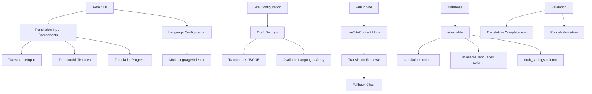

# Design Document: Multi-Language Content Management

## Overview

This design enables site administrators to configure which languages are available on their site and provide translated content for all user-facing text fields. The design focuses on 9 priority customer-facing pages and provides a foundation for expanding translation support to additional content areas.

This design complements the internationalization-improvements spec which handles formatting (currency, dates, numbers, RTL layout). Together, they provide complete internationalization: translated content displayed with locale-appropriate formatting.

**Key Features:**
- Per-site language configuration
- Translatable input components with tabbed interface
- Translation progress tracking
- Validation before publishing
- Fallback chain for missing translations
- Integration with draft/publish workflow
- Migration of existing content

## Architecture

### High-Level Architecture



### Design Principles

1. **Separation of Concerns**: Content translation (this spec) is separate from formatting (i18n-improvements spec)
2. **Graceful Degradation**: Missing translations fall back through a defined chain
3. **Draft-First**: All changes go through draft/publish workflow
4. **Validation at Boundaries**: Validate on save and before publish
5. **Component Reusability**: Translation components work for any text field
6. **Performance**: Translations stored in indexed JSONB for fast retrieval

### Component Layers

**Layer 1: Database**
- sites.translations (JSONB): Stores all translations
- sites.available_languages (TEXT[]): Stores enabled languages
- sites.draft_settings (JSONB): Stores draft translations
- sites.draft_available_languages (TEXT[]): Stores draft language config

**Layer 2: Backend API**
- CRUD operations for translations
- Migration scripts for existing content
- Validation logic

**Layer 3: Admin Components**
- MultiLanguageSelector: Language configuration UI
- TranslatableInput: Single-line translation input
- TranslatableTextarea: Multi-line translation input
- TranslationProgress: Completion tracking

**Layer 4: Public Site**
- useSiteContent: Hook for retrieving translations
- Translation fallback logic
- Integration with formatting hooks

**Layer 5: Validation**
- Translation completeness calculation
- Publish validation
- Error handling

## Data Models

### Database Schema

```sql
-- Sites table extensions
ALTER TABLE sites 
ADD COLUMN IF NOT EXISTS available_languages TEXT[] DEFAULT ARRAY['en'];

ALTER TABLE sites 
ADD COLUMN IF NOT EXISTS translations JSONB DEFAULT '{}'::jsonb;

ALTER TABLE sites 
ADD COLUMN IF NOT EXISTS draft_available_languages TEXT[] DEFAULT NULL;

-- Indexes for performance
CREATE INDEX IF NOT EXISTS idx_sites_available_languages 
ON sites USING GIN (available_languages);

CREATE INDEX IF NOT EXISTS idx_sites_translations 
ON sites USING GIN (translations);
```

### Translation Structure

```typescript
interface SiteTranslations {
  // Header
  header: {
    logoAlt: { [language: string]: string };
    homeLink: { [language: string]: string };
    productsLink: { [language: string]: string };
    aboutLink: { [language: string]: string };
    contactLink: { [language: string]: string };
    ctaButton: { [language: string]: string };
  };
  
  // Welcome Page
  welcomePage: {
    title: { [language: string]: string };
    message: { [language: string]: string };
    buttonText: { [language: string]: string };
  };
  
  // Landing Page
  landingPage: {
    heroTitle: { [language: string]: string };
    heroSubtitle: { [language: string]: string };
    heroCTA: { [language: string]: string };
  };
  
  // Access Validation Page
  accessPage: {
    title: { [language: string]: string };
    description: { [language: string]: string };
    buttonText: { [language: string]: string };
    errorMessage: { [language: string]: string };
    successMessage: { [language: string]: string };
  };
  
  // Catalog Page
  catalogPage: {
    title: { [language: string]: string };
    description: { [language: string]: string };
    emptyMessage: { [language: string]: string };
    filterAllText: { [language: string]: string };
    searchPlaceholder: { [language: string]: string };
  };
  
  // Product Detail Page
  productDetail: {
    backButton: { [language: string]: string };
    addToCart: { [language: string]: string };
    buyNow: { [language: string]: string };
    outOfStock: { [language: string]: string };
    specifications: { [language: string]: string };
    description: { [language: string]: string };
  };
  
  // Cart Page
  cartPage: {
    title: { [language: string]: string };
    emptyMessage: { [language: string]: string };
    emptyDescription: { [language: string]: string };
    browseButton: { [language: string]: string };
    removeButton: { [language: string]: string };
    clearCartButton: { [language: string]: string };
    clearCartConfirm: { [language: string]: string };
    subtotalLabel: { [language: string]: string };
    shippingLabel: { [language: string]: string };
    taxLabel: { [language: string]: string };
    totalLabel: { [language: string]: string };
    checkoutButton: { [language: string]: string };
    continueShoppingButton: { [language: string]: string };
    securityNotice: { [language: string]: string };
  };
  
  // Checkout Page
  checkoutPage: {
    title: { [language: string]: string };
    shippingTitle: { [language: string]: string };
    paymentTitle: { [language: string]: string };
    orderSummary: { [language: string]: string };
    placeOrderButton: { [language: string]: string };
    freeShippingMessage: { [language: string]: string };
  };
  
  // Review Order Page
  reviewOrder: {
    title: { [language: string]: string };
    instructions: { [language: string]: string };
    confirmButton: { [language: string]: string };
    editButton: { [language: string]: string };
    shippingLabel: { [language: string]: string };
    itemsLabel: { [language: string]: string };
  };
  
  // Confirmation Page
  confirmation: {
    title: { [language: string]: string };
    message: { [language: string]: string };
    orderNumberLabel: { [language: string]: string };
    trackingLabel: { [language: string]: string };
    nextSteps: { [language: string]: string };
    continueButton: { [language: string]: string };
  };
  
  // Order History Page
  orderHistory: {
    title: { [language: string]: string };
    description: { [language: string]: string };
    emptyTitle: { [language: string]: string };
    emptyMessage: { [language: string]: string };
    browseButton: { [language: string]: string };
    viewDetailsButton: { [language: string]: string };
    statusPending: { [language: string]: string };
    statusConfirmed: { [language: string]: string };
    statusShipped: { [language: string]: string };
    statusDelivered: { [language: string]: string };
    statusCancelled: { [language: string]: string };
  };
  
  // Order Tracking Page
  orderTracking: {
    title: { [language: string]: string };
    orderNumberLabel: { [language: string]: string };
    placedOnLabel: { [language: string]: string };
    statusLabel: { [language: string]: string };
    orderPlacedLabel: { [language: string]: string };
    orderPlacedDesc: { [language: string]: string };
    orderConfirmedLabel: { [language: string]: string };
    orderConfirmedDesc: { [language: string]: string };
    shippedLabel: { [language: string]: string };
    shippedDesc: { [language: string]: string };
    deliveredLabel: { [language: string]: string };
    deliveredDesc: { [language: string]: string };
    trackingNumberLabel: { [language: string]: string };
    estimatedDeliveryLabel: { [language: string]: string };
    giftDetailsLabel: { [language: string]: string };
    shippingAddressLabel: { [language: string]: string };
    returnHomeButton: { [language: string]: string };
    printButton: { [language: string]: string };
    supportMessage: { [language: string]: string };
  };
  
  // Not Found Page
  notFoundPage: {
    title: { [language: string]: string };
    message: { [language: string]: string };
    homeButton: { [language: string]: string };
    adminLoginButton: { [language: string]: string };
    clientPortalButton: { [language: string]: string };
  };
  
  // Privacy Policy Page
  privacyPolicy: {
    title: { [language: string]: string };
    lastUpdated: { [language: string]: string };
    introductionTitle: { [language: string]: string };
    introductionText: { [language: string]: string };
    informationCollectedTitle: { [language: string]: string };
    howWeUseTitle: { [language: string]: string };
    yourRightsTitle: { [language: string]: string };
    dataSecurityTitle: { [language: string]: string };
    contactTitle: { [language: string]: string };
    privacySettingsButton: { [language: string]: string };
  };
  
  // Selection Period Expired Page
  expiredPage: {
    title: { [language: string]: string };
    message: { [language: string]: string };
    contactMessage: { [language: string]: string };
    returnHomeButton: { [language: string]: string };
  };
  
  // Footer
  footer: {
    text: { [language: string]: string };
    privacyLink: { [language: string]: string };
    termsLink: { [language: string]: string };
    contactLink: { [language: string]: string };
  };
}
```

### Site Configuration Extension

```typescript
interface Site {
  id: string;
  name: string;
  // ... existing fields
  
  // New fields
  available_languages: string[];
  translations: SiteTranslations;
  draft_available_languages?: string[];
  
  settings: {
    // ... existing settings
    defaultLanguage: string;
  };
  
  draft_settings?: {
    // ... existing draft settings
    defaultLanguage?: string;
    translations?: SiteTranslations;
  };
}
```

## Components and Interfaces

### 1. MultiLanguageSelector Component

```typescript
// src/app/components/admin/MultiLanguageSelector.tsx

interface MultiLanguageSelectorProps {
  selectedLanguages: string[];
  onChange: (languages: string[]) => void;
  defaultLanguage: string;
  onDefaultChange: (language: string) => void;
}

export function MultiLanguageSelector({
  selectedLanguages,
  onChange,
  defaultLanguage,
  onDefaultChange
}: MultiLanguageSelectorProps) {
  // Features:
  // - Search/filter languages
  // - Checkbox list of all 20 supported languages
  // - Visual indicator for default language
  // - "Set as default" button for selected languages
  // - Prevent unchecking default language
  // - Display count of selected languages
}
```

### 2. TranslatableInput Component

```typescript
// src/app/components/admin/TranslatableInput.tsx

interface TranslatableInputProps {
  label: string;
  value: Record<string, string>; // { en: "text", es: "texto" }
  onChange: (language: string, value: string) => void;
  availableLanguages: string[];
  defaultLanguage: string;
  required?: boolean;
  maxLength?: number;
  placeholder?: string;
}

export function TranslatableInput({
  label,
  value,
  onChange,
  availableLanguages,
  defaultLanguage,
  required,
  maxLength,
  placeholder
}: TranslatableInputProps) {
  // Features:
  // - Tabbed interface for each language
  // - Default language tab shown first
  // - Status indicators (translated, empty, required)
  // - Copy from default language button
  // - Character count display
  // - Validation for required fields
}
```

### 3. TranslatableTextarea Component

```typescript
// src/app/components/admin/TranslatableTextarea.tsx

interface TranslatableTextareaProps {
  label: string;
  value: Record<string, string>;
  onChange: (language: string, value: string) => void;
  availableLanguages: string[];
  defaultLanguage: string;
  rows?: number;
  maxLength?: number;
  placeholder?: string;
}

export function TranslatableTextarea({
  label,
  value,
  onChange,
  availableLanguages,
  defaultLanguage,
  rows,
  maxLength,
  placeholder
}: TranslatableTextareaProps) {
  // Similar to TranslatableInput but with textarea
}
```

### 4. TranslationProgress Component

```typescript
// src/app/components/admin/TranslationProgress.tsx

interface TranslationProgressProps {
  translations: Record<string, Record<string, string>>;
  availableLanguages: string[];
  requiredFields: string[];
}

export function TranslationProgress({
  translations,
  availableLanguages,
  requiredFields
}: TranslationProgressProps) {
  // Features:
  // - Calculate completion percentage per language
  // - Display progress bar per language
  // - Color-code complete vs incomplete
  // - Show count of completed/total fields
}
```

### 5. useSiteContent Hook

```typescript
// src/app/hooks/useSiteContent.ts

export function useSiteContent() {
  const { currentSite } = useSite();
  const { language } = useLanguage();

  const getTranslatedContent = (path: string, fallback: string = ''): string => {
    // Implementation:
    // 1. Navigate to field using path (e.g., "welcomePage.title")
    // 2. Try current language
    // 3. Fallback to default language
    // 4. Fallback to English
    // 5. Fallback to first available translation
    // 6. Fallback to provided fallback string
    // 7. Handle errors gracefully
  };

  return { getTranslatedContent };
}
```

### 6. Translation Validation Utilities

```typescript
// src/app/utils/translationValidation.ts

export interface TranslationValidationResult {
  isComplete: boolean;
  missingTranslations: Array<{ field: string; language: string }>;
  completionPercentage: number;
}

export function validateTranslations(
  translations: Record<string, Record<string, string>>,
  requiredFields: string[],
  availableLanguages: string[]
): TranslationValidationResult {
  // Calculate completion percentage
  // Identify missing translations
  // Return validation result
}

export function canPublishTranslations(
  translations: Record<string, Record<string, string>>,
  requiredFields: string[],
  defaultLanguage: string
): { canPublish: boolean; reason?: string } {
  // Validate default language translations
  // Return publish eligibility
}
```

## Translation Fallback Chain

The system uses a multi-level fallback chain to ensure content is always displayed:

```
1. Current Language (e.g., 'es')
   ↓ (if missing)
2. Default Language (e.g., 'en')
   ↓ (if missing)
3. English ('en')
   ↓ (if missing)
4. First Available Translation
   ↓ (if missing)
5. Provided Fallback String
```

Example:
```typescript
// User selects Spanish, default is English
getTranslatedContent('welcomePage.title', 'Welcome')

// Tries in order:
// 1. translations.welcomePage.title.es
// 2. translations.welcomePage.title.en (default)
// 3. translations.welcomePage.title.en (English)
// 4. First value in translations.welcomePage.title
// 5. 'Welcome' (fallback parameter)
```

## Correctness Properties

### Property 1: Translation Retrieval Always Returns a String
*For any* field path and fallback string, when getTranslatedContent is called, the result should always be a string (never null or undefined).
**Validates: Requirements 6.1, 6.6, 11.1, 11.2, 11.3**

### Property 2: Fallback Chain Always Terminates
*For any* field path with a non-empty fallback string, when getTranslatedContent is called, the result should always be a non-empty string.
**Validates: Requirements 6.2, 6.3, 6.4, 6.5, 6.6**

### Property 3: Completion Percentage is Bounded
*For any* set of translations, required fields, and available languages, the completion percentage should always be between 0 and 100 (inclusive).
**Validates: Requirements 4.1, 4.6, 4.7**

### Property 4: Default Language Validation is Strict
*For any* set of translations and required fields, if any required field is missing a default language translation, canPublishTranslations should return false.
**Validates: Requirements 5.1, 5.2, 5.3**

### Property 5: Language Switching Updates All Content
*For any* language change, all translated content on the page should update to reflect the new language.
**Validates: Requirements 6.10, 12.9**

### Property 6: Draft Changes Don't Affect Live Site
*For any* draft translation changes, the live site content should remain unchanged until publish.
**Validates: Requirements 9.3, 9.7**

### Property 7: Migration Preserves Content
*For any* existing site content, after migration, all content should be accessible as English translations.
**Validates: Requirements 8.1-8.11**

## Error Handling

### Translation Retrieval Errors

```typescript
function safeGetTranslation(path: string, fallback: string): string {
  try {
    // Navigate path
    // Apply fallback chain
    return result;
  } catch (error) {
    console.warn(`Translation error for path "${path}":`, error);
    return fallback;
  }
}
```

### Validation Errors

```typescript
function validateBeforePublish(translations, requiredFields, defaultLanguage) {
  const errors: string[] = [];
  
  for (const field of requiredFields) {
    if (!translations[field]?.[defaultLanguage]?.trim()) {
      errors.push(`Missing required translation: ${field} (${defaultLanguage})`);
    }
  }
  
  if (errors.length > 0) {
    return { canPublish: false, errors };
  }
  
  return { canPublish: true };
}
```

### Component Error Boundaries

All translation components should handle errors gracefully:
- Invalid props → Use defaults
- Missing translations → Show placeholder
- API errors → Display error message
- Never crash the UI

## Integration Points

### With Internationalization Formatting

```typescript
// Example: Translated content with currency formatting
const { getTranslatedContent } = useSiteContent();
const { formatPrice } = useCurrencyFormat();

const freeShippingText = getTranslatedContent(
  'checkoutPage.freeShippingMessage',
  'Free shipping on orders over {amount}'
);

const formattedText = freeShippingText.replace(
  '{amount}',
  formatPrice(50)
);
// Result: "Free shipping on orders over $50.00" (en-US)
// Result: "Envío gratis en pedidos superiores a 50,00 €" (es-ES)
```

### With Draft/Publish Workflow

```typescript
// Save draft
function saveDraft(translations, availableLanguages) {
  await updateSite({
    draft_settings: {
      ...currentDraftSettings,
      translations
    },
    draft_available_languages: availableLanguages
  });
}

// Publish
function publish() {
  const validation = canPublishTranslations(
    draftTranslations,
    requiredFields,
    defaultLanguage
  );
  
  if (!validation.canPublish) {
    throw new Error(validation.reason);
  }
  
  await updateSite({
    settings: {
      ...currentSettings,
      translations: draftTranslations
    },
    available_languages: draftAvailableLanguages,
    translations: draftTranslations
  });
}
```

### With RTL Layout

```typescript
// Translated content automatically works with RTL
const { getTranslatedContent } = useSiteContent();
const { language } = useLanguage();
const direction = getTextDirection(language);

<div dir={direction}>
  <h1>{getTranslatedContent('welcomePage.title', 'Welcome')}</h1>
</div>
// Arabic: <div dir="rtl"><h1>مرحبا</h1></div>
// English: <div dir="ltr"><h1>Welcome</h1></div>
```

## Testing Strategy

### Unit Tests
- Translation retrieval with valid paths
- Fallback chain behavior
- Validation logic
- Component rendering
- Error handling

### Property-Based Tests
- Translation retrieval always returns string
- Fallback chain always terminates
- Completion percentage is bounded
- Validation is consistent

### Integration Tests
- Language switching updates content
- Draft/publish workflow
- Migration preserves content
- RTL layout with translations

### E2E Tests
- Complete admin workflow
- Complete user workflow
- Multi-language site experience

## Performance Considerations

### Database
- GIN indexes on JSONB columns for fast queries
- Translations loaded with site data (no extra queries)
- Efficient JSONB storage (only stores provided translations)

### Frontend
- useSiteContent hook memoizes results
- Translation components use React.memo
- Language switching batches updates
- Fallback chain short-circuits on first match

### Caching
- Site translations cached in SiteContext
- Language preference cached in localStorage
- Translation validation results cached

## Migration Strategy

### Phase 1: Database Setup
1. Add new columns to sites table
2. Create indexes
3. Run migration script for existing content

### Phase 2: Admin UI
1. Create translation components
2. Integrate with Site Configuration
3. Add validation

### Phase 3: Public Site
1. Create useSiteContent hook
2. Update all 9 priority pages
3. Test fallback behavior

### Phase 4: Testing & Rollout
1. Run all tests
2. Manual QA
3. Deploy to production
4. Monitor for issues

## Security Considerations

- Validate translation input for XSS
- Sanitize HTML in translations
- Limit translation size to prevent DoS
- Validate language codes against whitelist
- Audit log translation changes

## Accessibility Considerations

- Translation tabs keyboard navigable
- Screen reader announcements for language changes
- ARIA labels for translation status
- High contrast for status indicators
- Focus management in translation interface
