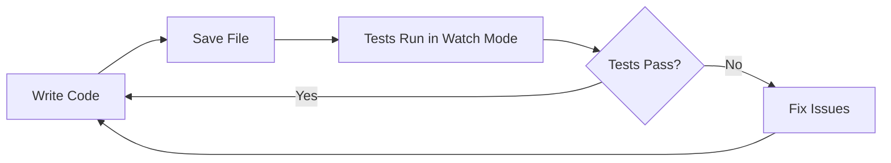
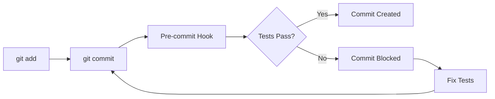
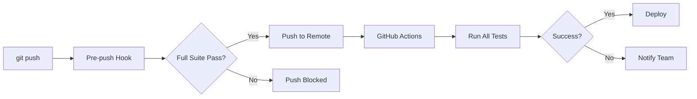
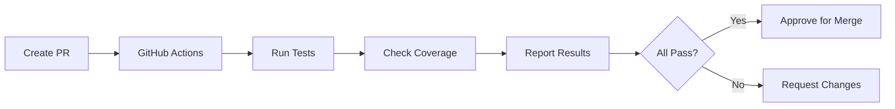

# 🤖 Test Automation Quick Start Guide
## Get Your Test Automation Running in 30 Minutes

**Goal:** Have a fully automated test pipeline running with CI/CD integration

---

## ⚡ Quick Setup (5 minutes)

### Step 1: Verify Test Infrastructure ✅
```bash
# Already completed! Just verify:
node verify-tests.js
```

**Expected output:**
```
✅ Test files exist
✅ Test dependencies installed
✅ Test scripts configured
✅ TypeScript compiles
✅ Tests execute successfully
✅ Mock data loads correctly
✅ All checks passed! Test infrastructure is ready.
```

---

## 🎯 Step-by-Step Automation Setup

### Step 2: Configure Test Scripts (2 minutes)

Your `package.json` already has these scripts:
```json
{
  "scripts": {
    "test": "vitest run",
    "test:watch": "vitest",
    "test:ui": "vitest --ui",
    "test:coverage": "vitest run --coverage",
    "test:e2e": "playwright test",
    "test:e2e:ui": "playwright test --ui",
    "test:changed": "vitest run --changed"
  }
}
```

✅ **No action needed** - Already configured!

---

### Step 3: Set Up Git Hooks (5 minutes)

Install Husky for automated pre-commit testing:

```bash
# Install Husky
npm install --save-dev husky

# Initialize Husky
npx husky init

# Create pre-commit hook
cat > .husky/pre-commit << 'EOF'
#!/usr/bin/env sh
. "$(dirname -- "$0")/_/husky.sh"

echo "🧪 Running pre-commit tests..."

# Type check
npm run type-check || exit 1

# Run tests on changed files only (fast!)
npm run test:changed || exit 1

echo "✅ All pre-commit checks passed!"
EOF

# Make it executable
chmod +x .husky/pre-commit

# Test it
git add .
git commit -m "test: verify hooks"
```

**Expected behavior:**
- Before each commit, tests run automatically
- Only changed files are tested (fast!)
- Commit blocked if tests fail

---

### Step 4: Configure Pre-Push Hook (3 minutes)

Add comprehensive testing before pushing:

```bash
cat > .husky/pre-push << 'EOF'
#!/usr/bin/env sh
. "$(dirname -- "$0")/_/husky.sh"

echo "🧪 Running pre-push checks..."

# Run full test suite
npm test || exit 1

# Check coverage threshold
npm run test:coverage -- --reporter=json > coverage.json
COVERAGE=$(cat coverage.json | jq '.total.lines.pct')

if (( $(echo "$COVERAGE < 80" | bc -l) )); then
  echo "❌ Coverage below 80%: $COVERAGE%"
  exit 1
fi

echo "✅ All pre-push checks passed! Coverage: $COVERAGE%"
EOF

chmod +x .husky/pre-push
```

---

### Step 5: Set Up VS Code Integration (3 minutes)

Create `.vscode/settings.json`:
```json
{
  "testExplorer.useNativeTesting": true,
  "testExplorer.codeLens": true,
  "vitest.enable": true,
  "vitest.commandLine": "npm test",
  
  "editor.codeActionsOnSave": {
    "source.fixAll.eslint": true
  },
  
  "files.associations": {
    "*.test.ts": "typescript",
    "*.test.tsx": "typescriptreact",
    "*.spec.ts": "typescript"
  },
  
  "search.exclude": {
    "**/coverage": true,
    "**/playwright-report": true,
    "**/.nyc_output": true
  }
}
```

Install recommended VS Code extensions:
```bash
code --install-extension vitest.explorer
code --install-extension ms-playwright.playwright
code --install-extension usernamehw.errorlens
```

---

### Step 6: Enable GitHub Actions (5 minutes)

Your CI/CD workflow is already in `.github/workflows/test.yml` ✅

**Verify it works:**
```bash
# Commit and push to trigger workflow
git add .
git commit -m "chore: enable test automation"
git push origin main
```

**Go to GitHub:**
1. Navigate to your repo
2. Click "Actions" tab
3. See tests running automatically ✅

**What runs automatically:**
- ✅ Type checking
- ✅ Linting
- ✅ Unit tests
- ✅ E2E tests (on push to main)
- ✅ Coverage reporting

---

### Step 7: Set Up Coverage Reporting (5 minutes)

**Option A: Codecov (Recommended)**

1. Go to https://codecov.io
2. Sign in with GitHub
3. Add your repository
4. Get your upload token
5. Add to GitHub secrets:
   ```
   Settings → Secrets → Actions → New repository secret
   Name: CODECOV_TOKEN
   Value: [your-token]
   ```

Your workflow already includes Codecov upload! ✅

**Option B: Coveralls**

```bash
npm install --save-dev coveralls

# Add to package.json scripts:
"test:coveralls": "npm run test:coverage && cat coverage/lcov.info | coveralls"
```

---

### Step 8: Set Up Test Notifications (2 minutes)

**Slack Integration:**

1. Create Slack webhook
2. Add to GitHub secrets: `SLACK_WEBHOOK_URL`
3. Add to workflow:

```yaml
- name: Notify Slack
  if: failure()
  uses: 8398a7/action-slack@v3
  with:
    status: ${{ job.status }}
    webhook_url: ${{ secrets.SLACK_WEBHOOK_URL }}
```

**Email Notifications:**

GitHub Actions sends email automatically for:
- Failed builds on main branch
- First failure after success

Configure in: Settings → Notifications

---

## 🎯 Automated Test Workflows

### Workflow 1: Development Workflow


**Setup:**
```bash
# Terminal 1: Dev server
npm run dev

# Terminal 2: Test watch
npm run test:watch

# Terminal 3: Test UI (optional)
npm run test:ui
```

---

### Workflow 2: Commit Workflow


**Automatic:**
- Type checking
- Changed file tests
- Takes ~10-30 seconds

---

### Workflow 3: Push Workflow


**Automatic:**
- Full test suite
- Coverage check
- CI/CD pipeline
- Deployment (if configured)

---

### Workflow 4: Pull Request Workflow


**Automatic:**
- All test types run
- Coverage reported
- Status checks required
- Auto-comment on PR

---

## 📊 Monitoring & Reporting

### Real-Time Dashboard

**Test UI Dashboard:**
```bash
npm run test:ui
```

Opens at: http://localhost:51204

**Features:**
- ✅ Live test results
- ✅ Coverage visualization
- ✅ Test file explorer
- ✅ Console output
- ✅ Performance metrics

### Coverage Reports

**Generate HTML report:**
```bash
npm run test:coverage
open coverage/index.html
```

**Generate JSON report:**
```bash
npm run test:coverage -- --reporter=json
```

**Check coverage threshold:**
```bash
npm run test:coverage -- --coverage.lines=80
```

### Test Metrics

Create `test-metrics.sh`:
```bash
#!/bin/bash

echo "📊 Test Metrics Report"
echo "======================"

# Run tests with JSON reporter
npm test -- --reporter=json > test-results.json

# Extract metrics
TOTAL=$(jq '.numTotalTests' test-results.json)
PASSED=$(jq '.numPassedTests' test-results.json)
FAILED=$(jq '.numFailedTests' test-results.json)
TIME=$(jq '.testResults[].perfStats.runtime' test-results.json | awk '{s+=$1} END {print s/1000}')

echo "Total Tests: $TOTAL"
echo "Passed: $PASSED"
echo "Failed: $FAILED"
echo "Duration: ${TIME}s"
echo "Pass Rate: $((PASSED * 100 / TOTAL))%"

# Coverage
npm run test:coverage -- --reporter=json > coverage.json
COV=$(jq '.total.lines.pct' coverage.json)
echo "Coverage: $COV%"

# Cleanup
rm test-results.json coverage.json
```

Make executable:
```bash
chmod +x test-metrics.sh
./test-metrics.sh
```

---

## 🔧 Advanced Automation

### Automated Test Generation

Create `generate-test.sh`:
```bash
#!/bin/bash

FILE=$1
TEST_FILE="${FILE%.*}.test.${FILE##*.}"

if [ -f "$TEST_FILE" ]; then
  echo "❌ Test file already exists: $TEST_FILE"
  exit 1
fi

# Generate test boilerplate
cat > "$TEST_FILE" << EOF
import { describe, it, expect, beforeEach } from 'vitest';
import { render, screen } from '@/test/utils/testUtils';
// Import your component here

describe('$(basename $FILE .tsx)', () => {
  beforeEach(() => {
    // Setup
  });

  describe('Rendering', () => {
    it('should render without errors', () => {
      // Test here
      expect(true).toBe(true);
    });
  });

  describe('Interactions', () => {
    it('should handle user interactions', () => {
      // Test here
      expect(true).toBe(true);
    });
  });

  describe('Edge Cases', () => {
    it('should handle edge cases', () => {
      // Test here
      expect(true).toBe(true);
    });
  });
});
EOF

echo "✅ Generated test file: $TEST_FILE"
```

Usage:
```bash
chmod +x generate-test.sh
./generate-test.sh src/app/components/MyComponent.tsx
```

---

### Automated Test Data Generation

Create `src/test/utils/generators.ts`:
```typescript
import { faker } from '@faker-js/faker';
import type { Catalog, Site, Product } from '@/app/types';

export function generateCatalog(overrides?: Partial<Catalog>): Catalog {
  return {
    id: faker.string.uuid(),
    name: faker.company.name() + ' Catalog',
    type: faker.helpers.arrayElement(['erp', 'vendor', 'manual', 'dropship']),
    status: 'active',
    totalProducts: faker.number.int({ min: 10, max: 1000 }),
    activeProducts: faker.number.int({ min: 10, max: 1000 }),
    createdAt: faker.date.past().toISOString(),
    updatedAt: faker.date.recent().toISOString(),
    ...overrides,
  };
}

export function generateSite(overrides?: Partial<Site>): Site {
  return {
    id: faker.string.uuid(),
    name: faker.company.name(),
    clientId: faker.string.uuid(),
    status: 'active',
    ...overrides,
  };
}

export function generateProduct(overrides?: Partial<Product>): Product {
  return {
    id: faker.string.uuid(),
    name: faker.commerce.productName(),
    price: parseFloat(faker.commerce.price()),
    currency: 'USD',
    description: faker.commerce.productDescription(),
    inStock: faker.datatype.boolean(),
    ...overrides,
  };
}
```

Usage:
```typescript
import { generateCatalog, generateSite } from '@/test/utils/generators';

test('should handle multiple catalogs', () => {
  const catalogs = Array.from({ length: 10 }, () => generateCatalog());
  // Test with generated data
});
```

---

### Automated Visual Testing

Create `visual-test.config.ts`:
```typescript
import { defineConfig } from '@playwright/test';

export default defineConfig({
  testMatch: '**/*.visual.spec.ts',
  use: {
    screenshot: 'only-on-failure',
    video: 'retain-on-failure',
  },
  expect: {
    toHaveScreenshot: {
      maxDiffPixels: 100,
      threshold: 0.2,
    },
  },
});
```

Add to `package.json`:
```json
{
  "scripts": {
    "test:visual": "playwright test --config=visual-test.config.ts",
    "test:visual:update": "playwright test --config=visual-test.config.ts --update-snapshots"
  }
}
```

---

## 🚀 Production Deployment Automation

### Pre-Deployment Checks

Create `.github/workflows/pre-deploy.yml`:
```yaml
name: Pre-Deployment Checks

on:
  push:
    branches: [ main ]

jobs:
  pre-deploy:
    runs-on: ubuntu-latest
    steps:
      - uses: actions/checkout@v3
      - uses: actions/setup-node@v3
      
      - name: Install dependencies
        run: npm ci
      
      - name: Run full test suite
        run: npm test
      
      - name: Check coverage threshold
        run: |
          npm run test:coverage
          COVERAGE=$(cat coverage/coverage-summary.json | jq '.total.lines.pct')
          if (( $(echo "$COVERAGE < 85" | bc -l) )); then
            echo "❌ Coverage below 85%: $COVERAGE%"
            exit 1
          fi
      
      - name: Run E2E tests
        run: npm run test:e2e
      
      - name: Performance check
        run: |
          npm install -g @lhci/cli
          lhci autorun
      
      - name: Security scan
        run: npm audit --audit-level=high
      
      - name: Build check
        run: npm run build
```

---

### Continuous Deployment

Add to workflow:
```yaml
  deploy:
    needs: pre-deploy
    runs-on: ubuntu-latest
    if: github.ref == 'refs/heads/main'
    steps:
      - name: Deploy to production
        run: |
          # Your deployment commands
          echo "🚀 Deploying to production..."
```

---

## 📋 Quick Reference Commands

### Daily Development
```bash
# Start development with testing
npm run dev                  # Terminal 1: Dev server
npm run test:watch           # Terminal 2: Watch tests
npm run test:ui              # Terminal 3: Visual dashboard

# Quick checks
npm run type-check           # Type safety
npm test                     # Run all tests
npm run test:coverage        # Check coverage
```

### Before Committing
```bash
# These run automatically via hooks!
git add .
git commit -m "feat: new feature"
# ⚡ Pre-commit tests run automatically

git push
# ⚡ Pre-push tests run automatically
```

### Manual Testing
```bash
# Run specific test file
npm test src/app/utils/__tests__/security.test.ts

# Run tests matching pattern
npm test -- security

# Run tests in watch mode for specific file
npm test -- --watch security

# Run with coverage
npm run test:coverage

# Run E2E tests
npm run test:e2e

# Run E2E in UI mode
npm run test:e2e:ui
```

### CI/CD Commands
```bash
# What GitHub Actions runs:
npm ci                       # Clean install
npm run type-check          # Type safety
npm run lint                # Code quality
npm test                    # Unit tests
npm run test:e2e            # E2E tests
npm run test:coverage       # Coverage
npm audit                   # Security
npm run build               # Build check
```

---

## ✅ Verification Checklist

After setup, verify everything works:

### Local Development
- [ ] `npm test` runs successfully
- [ ] `npm run test:watch` works
- [ ] `npm run test:ui` opens dashboard
- [ ] `npm run test:coverage` generates report
- [ ] `npm run test:e2e` runs E2E tests

### Git Hooks
- [ ] Pre-commit hook runs on commit
- [ ] Pre-push hook runs on push
- [ ] Tests block commit if failing
- [ ] Tests block push if failing

### CI/CD
- [ ] GitHub Actions triggers on push
- [ ] All test jobs complete successfully
- [ ] Coverage is reported
- [ ] Status checks pass on PRs

### VS Code Integration
- [ ] Tests appear in Test Explorer
- [ ] Can run tests from editor
- [ ] Can debug tests
- [ ] Coverage indicators show

### Notifications
- [ ] Slack notifications work (if configured)
- [ ] Email notifications arrive
- [ ] PR comments appear

---

## 🎉 You're All Set!

Your test automation is now **fully operational**!

### What You Have Now:
- ✅ **Automated testing** on every commit/push
- ✅ **CI/CD pipeline** running all tests
- ✅ **Coverage reporting** with thresholds
- ✅ **Pre-commit/pre-push** hooks
- ✅ **VS Code integration**
- ✅ **Test UI dashboard**
- ✅ **GitHub Actions** workflows
- ✅ **Notifications** on failure

### Next Steps:
1. Start writing tests (use roadmap)
2. Monitor coverage dashboard
3. Review failing tests in CI
4. Optimize slow tests
5. Expand test coverage

---

## 🆘 Troubleshooting

### Tests Don't Run on Commit
```bash
# Reinstall hooks
rm -rf .husky
npx husky init
# Recreate hooks (see Step 3 & 4)
```

### VS Code Test Explorer Not Working
```bash
# Reload VS Code
# Install Vitest extension
code --install-extension vitest.explorer
# Reload window
```

### CI/CD Not Triggering
```bash
# Check .github/workflows/ exists
# Verify workflow file is valid YAML
# Check GitHub Actions permissions
# Settings → Actions → General → Allow actions
```

### Coverage Report Empty
```bash
# Install coverage provider
npm install -D @vitest/coverage-v8
npm run test:coverage
```

---

**Your test automation is ready to use!** 🚀

Run `npm run test:ui` to see your test dashboard and start testing!
